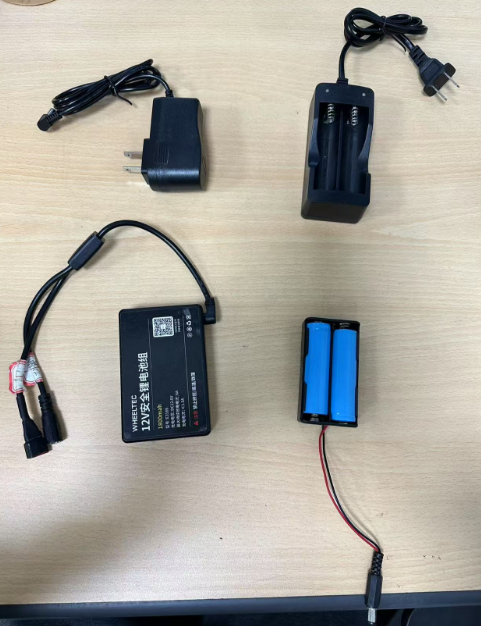
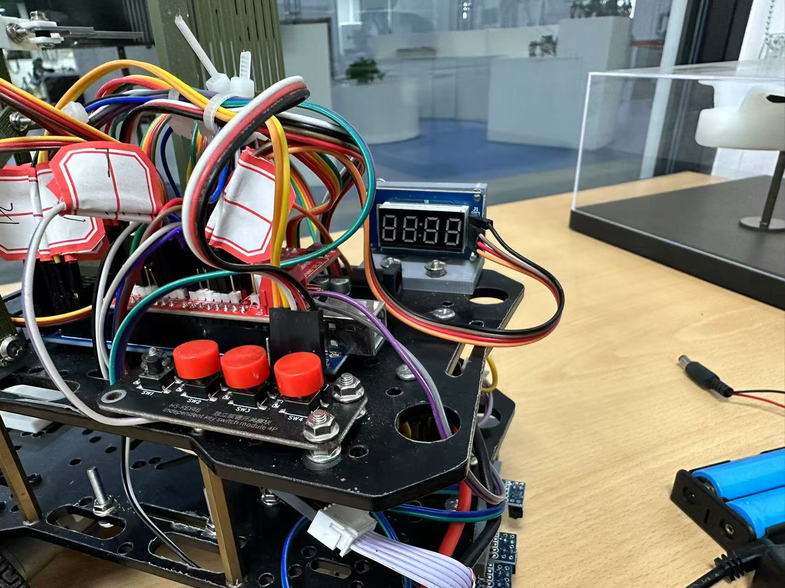

# Exercise1: Line Tracking

## 问题出处

本次练习的代码出自2024年中控杯智能小车对抗赛“疑悟队”，没有额外改动，只挖去直走部分的代码留给各位补全。建议各位不要去阅读这份屎山代码💩，根据目标函数的输入输出进行代码的补全即可，以及主函数`main.ino`的部分修改。本人在挖代码的过程看着凌乱的代码已然回想起当时不太正常的精神状态☠️。

## 所需工具

需要各位在自己电脑上进行`Arduino`代码的补全或改写。在本地完成代码的编译后，上传至小车的`Arduino`开发板。直接使用工作室的小车，在基地场地进行调试即可。

具体操作请询问`@布拉奇 @旺仔大馒头`。后续有时间也会在本文档更新相关操作。

## 提交方式

将代码和视频打包成压缩包，命名格式为【姓名+巡线任务.zip】，发送至邮箱`1980501273@qq.com`。2025年3月1日前提交，预期成果可看本文档最后一节。

## 问题描述

根据传感器获取的信息，调整左右车轮的速度，使小车沿白线直走。

本练习**仅得到一份可运行的代码非常简单**，不过要让小车稳定直走还需要一定工作量进行调试。

待补全的函数位于`src/Straight.cpp`，内容如下所示，一些必要的解释也已经在代码中写出。

```c++
void Straight_Go1(unsigned int inspect12,double normal1,double current_angle)
{
  /* 
      用于处理巡线时直走情况的函数

      函数输入inspect12，normal1，current_angle三个变量

      没有输出，将直接使用 Set_Motor_Speed 函数调整车轮速度

      inspect12：0 ~ 4095的一个整数，将其转化为二进制数则对应12个传感器的状态，1代表检测到白色，2代表检测到黑色。其中前7位为小车前方7个传感器，后5位为后方5个传感器。
      normal1：当前的速度，前进为正，后退为负，前进时一般在30~50.
      current_angle：与直线的夹角（即偏离路线的角度），逆时针为正，顺时针为负。单位为弧度制，也即当current_angle=0时，车头正对直线,当current_angle=pi/4时，车头向左偏了45度。

      Set_Motor_Speed(左轮速度，右轮速度)：将左右轮速度调节到合适的速度。例如
      Set_Motor_Speed(normal1,normal1)将使车轮保持原速度不变。
      Set_Motor_Speed(normal1*0.1,normal1*0.1)。速度变为原来的0.1倍。
  */

  unsigned int inspect = inspect12 >> 5;
  unsigned int inspect_back=inspect12 & 31; 
  // 以上两个语句将前后方传感器分离开来
  // 运用位运算 如 & | 等可以方便二进制数的数据处理

  /*----------------在下方编写你的代码---------------------*/


  Set_Motor_Speed(normal1,normal1);  // 此语句需要修改，放置此处起提醒作用
  /*----------------在上方编写你的代码---------------------*/
  return;
}
```

建议忽略该文件中定义了的一堆乱七八糟的变量，我也不太记得那是用来干什么的。不过如果你想从中找到一些启发也可以，但不是很必要。

## 小车部分功能介绍

这一部分简单介绍一下部分调试过程中需要注意的地方。

### 电池

小车用到了一个12V锂电池和两个3.7V的电池，对应的充电设备如下所示。3.7V的电池耗电会比较快，建议各位在没有进行调试的时候都做断电处理（直接把线拔了就行）。
<div align=center>
  
</div>

两个电池的接口如下所示，左图是12V电池的接口，右图是3.7V电池的接口。

<div align=center>
    
</div>


目前两组电池都拆了下来，所以大家在装上电池的时候需要稍微考虑一下布局，之前的做法是两组电池都塞在中间的空腔中。

### 简单的操作

<div align=center>
  
</div>

首先简单介绍一下小车的三个按钮，按上图视角最右端的按钮是“开/关”按钮，按下小车开始执行相应的动作。

左边两个按钮用来选择小车执行的**方案**。

我们对小车的路线规划是确定的，**没有**通过机器学习训练模型让小车进行自主决策。我们使用`Action_List`和`Action_Speed`两个二维数组来存储小车的动作和速度。`Action_List[i][j]`对应小车的第`i`个策略的第`j`个动作，`Action_Speed[i][j]`对应小车的第`i`个策略的第`j`个动作的动作参数(如速度、角度等)。

显示器的左边两位为数字`i`，右边两位为`j`，表示当前小车正在执行方案`i`的第`j`个动作。

### 关于策略

各位可以直接修改`Action_List`和`Action_Speed`数组，以获得一条直行策略(如果你想尝试转弯等动作也可做相应修改)。同时下面的数组`List_num`也要修改一下参数，`List_num[i]`代表第`i`个方案的总动作数。

### 关于调试

首先需要上传自己的代码值Arduino开发板上，后续通过按钮选择自己需要的策略并按下“开/关”按钮运行小车开始调试。

<div align=center>
  
</div>

使用数据线(工作室内有)连接电脑和Arduino开发板，在**Arduino IDE**中上传代码即可，操作很简单，可以自行上网查一下，开发板类型是**Arduino Mega2560**。

## 预期成果

- 一份补全的可编译的代码
- 一段小车稳定直行的视频

完成代码的补全是十分简单的，但是希望各位都可以去上手调试一下小车，让小车尽量完成直走的任务。

对于该练习有任何疑问可以联系`@布拉奇 @旺仔大馒头`。
